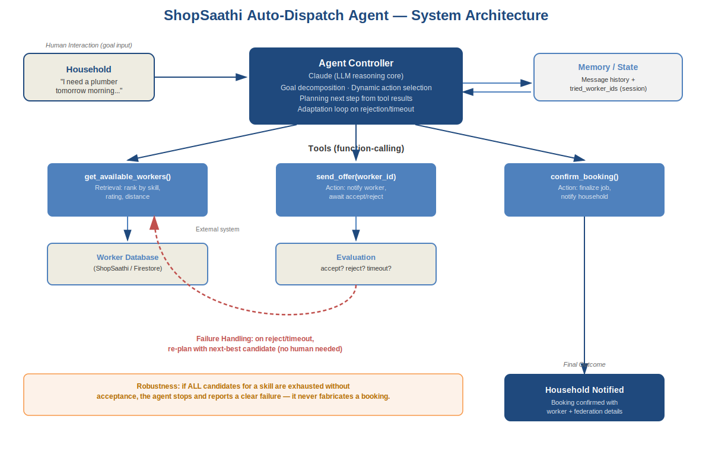

# ShopSaathi Auto-Dispatch Agent

**Agentic AI Hackathon — Tech Zephyr 4.0, IIT Bhubaneswar**
Team: _[Fill in your team name]_

An autonomous dispatch agent for [ShopSaathi](https://shopsaathi-e778c.web.app),
a cooperative-owned hyperlocal worker-matching platform. Given a
household's natural-language service request, the agent independently
finds, offers, and confirms a cooperative worker — **automatically
retrying with the next-best candidate if a worker rejects or times out,
with no human re-triggering the search.**

📄 Full problem & solution write-up: [`docs/Problem_Solution_Brief.md`](docs/Problem_Solution_Brief.md)
🖼️ Architecture diagram: [`assets/architecture.png`](assets/architecture.png)

---

## Why this is agentic (not just a script)

| Requirement | How this agent meets it |
|---|---|
| Goal-Driven Execution | The agent is given a goal ("get this household a confirmed worker"), not a fixed procedure |
| Dynamic Action Selection | Which worker to contact next is chosen live, based on the previous tool result |
| Multi-Step Execution | Retrieve → Offer → Evaluate → (Retry or Confirm) — a real loop, not one LLM call |
| Adaptation | On rejection/timeout, the agent autonomously re-plans with the next-best candidate |
| Robustness | If every candidate is exhausted, the agent reports failure honestly instead of fabricating a booking |

---

## Architecture



- **Agent/Controller**: Claude (LLM) reasoning loop — decides which tool
  to call next based on the conversation so far.
- **Tools**: `get_available_workers`, `send_offer`, `confirm_booking`
  (see `src/agent.py`).
- **External system**: worker database (`src/workers_db.json` here —
  simulates the ShopSaathi/Firestore worker collection).
- **Memory/state**: running message history + list of already-tried
  worker IDs, so the agent never re-offers to a worker who already
  rejected in the same session.
- **Evaluation**: each `send_offer` result is checked (accept/reject) to
  decide the next action.
- **Failure handling**: reject/timeout triggers an autonomous retry with
  the next-ranked candidate; exhausting all candidates triggers a clean
  failure report.
- **Human interaction**: limited to the household's initial request and
  the final confirmation notification — the dispatch loop itself runs
  with zero human input.

---

## Setup Instructions

### Dependencies
- Python 3.9+
- An Anthropic API key ([console.anthropic.com](https://console.anthropic.com))

### Install
```bash
git clone <this-repo-url>
cd agentic-dispatch
pip install -r requirements.txt
```

### Environment configuration
```bash
export ANTHROPIC_API_KEY="your_key_here"        # macOS/Linux
setx ANTHROPIC_API_KEY "your_key_here"           # Windows
```

### Run
```bash
cd src
python agent.py "I need a plumber tomorrow morning, my kitchen pipe is leaking badly."
```

The agent will print its reasoning and every tool call live, e.g.:

```
HOUSEHOLD REQUEST: "I need a plumber tomorrow morning, my kitchen pipe is leaking badly."
======================================================================

[AGENT] I'll find available plumbers and offer the job to the best-ranked one first.
  -> ACTION: get_available_workers({"service_type": "plumber"})
     Found 3 candidate(s): ['Ramesh Kumar', 'Suresh Patra', 'Manoj Sahoo']
  -> ACTION: send_offer({"worker_id": "W101"})
     ❌ REJECTED — Ramesh Kumar: Already booked for another job at that time slot

[AGENT] Ramesh Kumar isn't available. Trying the next-best candidate, Suresh Patra.
  -> ACTION: send_offer({"worker_id": "W102"})
     ❌ REJECTED — Suresh Patra: Outside preferred service radius today

[AGENT] Trying the next candidate, Manoj Sahoo.
  -> ACTION: send_offer({"worker_id": "W103"})
     ✅ ACCEPTED — Manoj Sahoo: Available and confirmed
  -> ACTION: confirm_booking({...})
     🎉 BOOKING CONFIRMED with Manoj Sahoo (Cuttack Cooperative Workers Union)
```

To try a different scenario (e.g. an electrician, or edit
`src/workers_db.json` to make every candidate reject and see the
robustness/failure path), just change the request text or the mock data.

---

## Project Structure
```
agentic-dispatch/
├── README.md
├── requirements.txt
├── docs/
│   └── Problem_Solution_Brief.md
├── assets/
│   ├── architecture.svg
│   └── architecture.png
└── src/
    ├── agent.py          # agent loop + tool implementations
    └── workers_db.json   # mock cooperative worker database
```

---

## Relation to ShopSaathi

This agent is built as an autonomous dispatch layer on top of our
existing ShopSaathi platform (live at
[shopsaathi-e778c.web.app](https://shopsaathi-e778c.web.app), source at
[github.com/yashveerniat/shopsaathi](https://github.com/yashveerniat/shopsaathi)),
which currently handles general hyperlocal worker/store matching (auth,
job posting/application, owner dashboard). This hackathon submission
extends that foundation with the cooperative-specific, autonomous
dispatch-and-retry capability described above; `workers_db.json` here is
a lightweight stand-in for the live Firestore worker collection so the
agent's reasoning can be demonstrated end-to-end without needing
production credentials.
